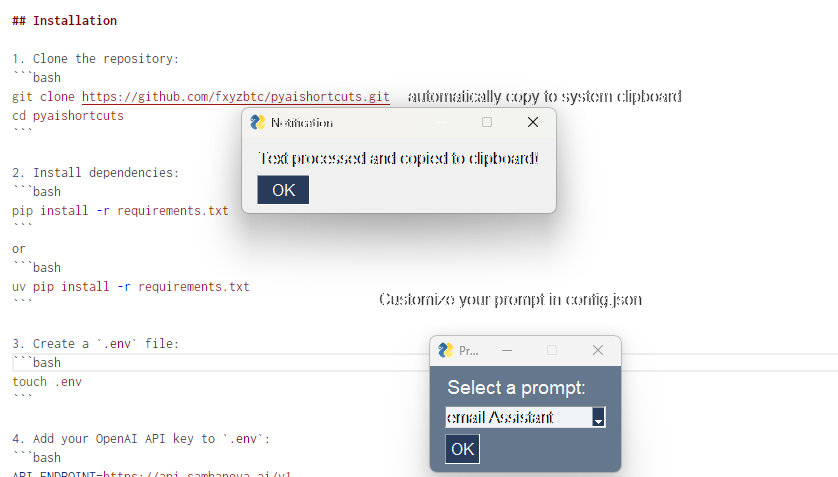

# AI Shortcuts

A powerful tool for creating custom AI-powered shortcuts using OpenAI's API. This application allows you to bind keyboard shortcuts to specific AI prompts and actions.





## Features

- 🔌 OpenAI API integration
- ⌨️ Custom keyboard shortcuts
- 📝 Customizable prompts
- 📋 Clipboard integration
- 📦 Environment variable support

## Installation

1. Clone the repository:
```bash
git clone https://github.com/fxyzbtc/pyaishortcuts.git
cd pyaishortcuts
```

2. Install dependencies:
```bash
pip install -r requirements.txt
```
or
```bash
uv pip install -r requirements.txt
```

3. Create a `.env` file:
```bash
touch .env
```

4. Add your OpenAI API key to `.env`:
```bash
API_ENDPOINT=https://api.sambanova.ai/v1
API_KEY=xxxxxxxx
MODEL=DeepSeek-R1-Distill-Llama-70B
```

## Configuration

### Configuring config.json

The `config.json` file allows you to customize prompts and keyboard shortcuts. Here's how to modify it:

1. Open `config.json` in your preferred text editor:
```bash
code config.json
```

2. Add a new shortcut:
```json
{
  "key_binding": {
    "shortcut": "ctrl+shift+a"
  },
  "shortcuts": {
    "my_custom_prompt": {
      "name": "My Custom Prompt",
      "default_prompt": "You are a helpful assistant...",
      "parameters": {
        "temperature": 0.7,
        "max_tokens": 500
      }
    }
  }
}
```

3. Save and close the file.

### Configuring .env

1. Open `.env` in your text editor:
```bash
code .env
```

2. Add your OpenAI API key and endpoint:
```bash
API_ENDPOINT=https://api.sambanova.ai/v1
API_KEY=xxxx
MODEL=DeepSeek-R1-Distill-Llama-70B
```

3. Save and close the file.

## Usage

1. Run the application:
```bash
# by source code
python main.py

# by package name
python -m pyaishortcuts

# by exe
pyaishortcuts
```

2. Use your keyboard shortcut to trigger the AI action.

## Development

### Setting up the Development Environment

1. Create and activate a virtual environment:
```bash
python -m venv .venv
source .venv/bin/activate  # On macOS/Linux
# or
.venv\Scripts\activate  # On Windows
```

2. Install development dependencies:
```bash
pip install -r requirements-dev.txt
```

### Code Style

This project uses:
- `black` for code formatting
- `isort` for import sorting
- `flake8` for linting

Run the following commands to format and lint your code:
```bash
black .
isort .
flake8 .
```

## Contributing

1. Fork the repository
2. Create a new branch:
```bash
git checkout -b feature/your-feature-name
```
3. Commit your changes:
```bash
git commit -m "Add your feature description"
```
4. Push to the branch:
```bash
git push origin feature/your-feature-name
```
5. Open a Pull Request

## License

This project is licensed under the MIT License. See the [LICENSE](LICENSE) file for details.

## Support

- 📫 Report issues on [GitHub Issues](https://github.com/fxyzbtc/pyaishortcuts/issues)
- 💬 Ask questions or discuss ideas in the project's discussion forum (if available)

---
Made with ❤️ using Python